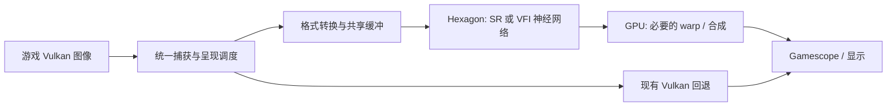

Qualcomm Hexagon NPU 对 Armada / LSFG-VK ARM64 的加速可行性核查

核查日期：2026-09-15。首个目标为 Snapdragon 8 Elite（SM8750），长期目标为覆盖更多 Hexagon 平台。本次完成公开资料、固定版本源码和官方 Linux ARM64 二进制包检查；没有连接目标掌机，没有完成 Armada 真机推理或性能测试。

**结论：可以开发 GPU/NPU 混合图像后端，优先做 NPU 超分原型；不能只换 SDK 或配置就把现有 LSFG 插帧搬到 NPU。** 当前最明确的开发起点是 54pkp/hexscale 的真实 QNN 适配器，加上 lsfg-vk 原生呈现和调度框架。实际是否提高游戏帧率、降低 GPU 占用和功耗，仍需在 SM8750/Armada 上验证。以下区分已核查事实与工程建议。

| 用户目标 | 判断 | 还需完成的关键工作 |
|---|---|---|
| 在 8 Elite / Armada 调用 Hexagon | 有具体 SDK、内核和固件基础，值得做真机验证 | Linux QNN + FastRPC + DSP 固件配套运行与正确输出 |
| 为项目增加 NPU 超分 | 可行性较高 | 合适的轻量 SR 模型、真实低分辨率输入、GPU/NPU 图像交换 |
| 原样迁移 LSFG 算法到 NPU | 目前没有可直接迁移的模型资产 | 原始图/权重或可转换表达、算子映射、精度和性能验证 |
| 使用其他算法替换插帧后端 | 技术上可行，工作量明显大于单帧超分 | 游戏运动估计、VFI 网络、跨帧同步、自动插帧呈现 |
| 接管全部 GPU 工作 | 不成立 | NPU适合承担图像网络计算；游戏渲染和呈现仍有 GPU 工作 |
| 所有 Hexagon 硬件统一启用 | 应按能力和实测分级支持 | SoC、Hexagon 代际、运行库、固件、模型和精度兼容矩阵 |

**项目本身的边界。** 审计的 decky-lsfg-vk-arm64 提交为 `2da96d3365576fa23e6844c0f3161073dfceb9d8`，其 native 文档指定 lsfg-vk 上游基线 `0e7a3898c1285b13df8596f2bd2cbb8f85b4383b`。Decky/Python 部分负责配置、安装和启动；实际计算在独立原生 Vulkan pipeline。当前没有独立超分模块，`flow_scale` 是内部运动估计分辨率比例，不能当作画面超分倍率。[项目 native 说明](https://github.com/mydanyi/decky-lsfg-vk-arm64/blob/2da96d3365576fa23e6844c0f3161073dfceb9d8/native/README.md)、[官方配置解释](https://lsfg-vk.dev/docs/configuration/options/)

原生实现通过 `ContextWrapper → lsfgvk::Context → Vulkan compute dispatch` 工作。已有组件边界，但没有现成的 QNN/provider 插拔接口。建议在 `InstanceWrapper/ContextWrapper` 与 pipeline 之间加入后端接口，保留现有帧历史、调度和降载逻辑。仅修改 Decky 配置无法改变执行设备。[wrapper.cpp](https://git.lsfg-vk.dev/lsfg-vk/tree/lsfg-vk-layer/src/wrapper.cpp?id=0e7a3898c1285b13df8596f2bd2cbb8f85b4383b#n170)、[pipeline dispatch](https://git.lsfg-vk.dev/lsfg-vk/tree/lsfg-vk-pipeline/src/pipeline.cpp?id=0e7a3898c1285b13df8596f2bd2cbb8f85b4383b#n755)

当前 v2 从商业 `lsfg-vk.dll` 的资源中读取 shader 字节并创建 Vulkan shader module。公开源码没有直接可交给 QNN converter 的 LSFG ONNX 训练图或独立权重包。因此不能承诺自动把现有 shader 翻译成 NPU 图；改用 QuickSRNet、XLSR 或其他 VFI 网络属于替换/新增算法，画质也要重新验收。本次没有商业 DLL，未验证其内部全部网络结构。[shader library](https://git.lsfg-vk.dev/lsfg-vk/tree/lsfg-vk-pipeline/src/library.cpp?id=0e7a3898c1285b13df8596f2bd2cbb8f85b4383b#n20)、[shader module 创建](https://git.lsfg-vk.dev/lsfg-vk/tree/lsfg-vk-helper/src/vkhelper.cpp?id=0e7a3898c1285b13df8596f2bd2cbb8f85b4383b#n142)

**两个 hexscale 示例的核查结果。** 这两个仓库能够帮助确定开发路线，但目前都不能作为已经在 Armada 上获得 NPU 游戏加速的实测证明。

| 固定源码版本 | 已实现/可复用 | 不应据此得出的结论 |
|---|---|---|
| drewano/hexscale `ce4aaac` | daemon、IPC、layer 等原型结构 | 不能证明真实 HTP 执行、零拷贝、720p→1080p 小于 1 ms 或小于 1 W |
| 54pkp/hexscale `8fed583` | 真实 QNN graph 执行、模型元数据、XLSR 分块、图像传输、离线插帧和 probe | 不能证明 Odin 3/Armada 真机成功、游戏实时插帧、端到端性能收益 |

drewano 版本的 `initialize()` 在找不到 QNN 库时仍可返回成功；`load_context_binary()` 只把文件读进内存；`execute_dmabuf()` 没有调用图执行，只计时后标记成功；host 路径是 CPU 双线性循环。因此 README 的性能和零拷贝描述没有对应的完成实现支撑。[直接源码证据](https://github.com/drewano/hexscale/blob/ce4aaacf60e6370a5a7086e19828b52f36a84bd6/daemon/src/qnn_backend.cpp#L16)

54pkp 版本则读取真实张量描述并调用 `graphExecute`，可以复用其 QNN provider/device/context 生命周期和错误处理。但其 I/O 使用 `QNN_TENSORMEMTYPE_RAW` 主机缓冲，`execute_dmabuf` 明确不支持，不能将它描述为现成的 GPU/NPU 零拷贝方案。[qnn_runtime.cpp](https://github.com/54pkp/hexscale/blob/8fed58387dcd5b417910b71f15b12d3aa1e509fa/daemon/src/qnn_runtime.cpp#L451)、[qnn_backend.cpp](https://github.com/54pkp/hexscale/blob/8fed58387dcd5b417910b71f15b12d3aa1e509fa/daemon/src/qnn_backend.cpp)

它的 Vulkan 路径是同步 GPU 读回 → daemon → 上传，处理前后维持相同交换链尺寸。该路径适合作为正确性基线；若目标是降低渲染负载，还必须让游戏真正以较低分辨率渲染，并通过引擎、虚拟交换链或 Gamescope 等路径分离渲染尺寸与输出尺寸。对原尺寸图像做处理本身不会减少游戏渲染量。[layer_entry.cpp](https://github.com/54pkp/hexscale/blob/8fed58387dcd5b417910b71f15b12d3aa1e509fa/layer/src/layer_entry.cpp#L350)

另一个实际性能问题是模型尺寸：当前 XLSR 为 **128×128 → 512×512 的 4×模型**，带 8 像素 halo，分块步长 112。按源码计算，1280×720 输入需要 `ceil(1280/112) × ceil(720/112) = 84` 次串行模型调用；1920×1080 为 180 次。即使只需 1.5×输出，它也先执行 4×网络再重采样。仅输出像素数就比原生 1.5×多约 `16/2.25 = 7.11` 倍；这不是总 FLOPs 或耗时倍率。首版性能实验更适合实际所需倍率的模型，以及整帧或更大 tile 的静态图。[frame_processor.cpp](https://github.com/54pkp/hexscale/blob/8fed58387dcd5b417910b71f15b12d3aa1e509fa/daemon/src/frame_processor.cpp#L56)、[模型清单](https://github.com/54pkp/hexscale/blob/8fed58387dcd5b417910b71f15b12d3aa1e509fa/models/MODEL-MANIFEST.json)

54pkp 的 ANVIL 工具需要外部 `FLOW.f32`；Vulkan 平滑已有运动矢量，不等于从游戏帧估计光流。还缺游戏运动来源、量化后画质验证和自动插帧呈现。作者明确记录：已做 Windows QNN CPU/Vulkan 正确性测试和 ARM64 交叉编译，**没有 Odin 3/Armada 真机执行结果**。[离线工具源码](https://github.com/54pkp/hexscale/blob/8fed58387dcd5b417910b71f15b12d3aa1e509fa/cli/src/interpolate.cpp#L129)、[验证范围](https://github.com/54pkp/hexscale/blob/8fed58387dcd5b417910b71f15b12d3aa1e509fa/README-QNN.md)

**应采用的 SDK 和开发资料。** 主路线是 QAIRT/QNN 的 HTP 后端；Hexagon SDK 用于确有必要的自定义 DSP/算子开发。它们提供的是图计算或 DSP 编程能力，不会自动接管任意 Vulkan compute shader。

| 资料/工具 | 在本项目中的作用 |
|---|---|
| [Qualcomm AI Engine Direct / QAIRT](https://www.qualcomm.com/developer/software/qualcomm-ai-engine-direct-sdk) | 模型转换、图准备、HTP 执行、profiling；优先的原生后端 |
| [QNN 开发文档](https://docs.qualcomm.com/doc/80-63442-10/topic/QNN_general_overview.html) | SoC/工具链矩阵、后端、图与算子 API |
| [Hexagon NPU SDK](https://www.qualcomm.com/developer/software/hexagon-npu-sdk) | HVX/DSP、自定义算子及低层优化；不能补齐缺失的设备固件 |
| [ONNX Runtime QNN EP](https://github.com/onnxruntime/onnxruntime-qnn/blob/main/docs/execution_providers/QNN-ExecutionProvider.md) | 快速验证 ONNX 模型是否可在 HTP 执行；实时集成再比较其与直接 QNN 的成本 |
| [Qualcomm AI Hub](https://aihub.qualcomm.com/) | 获取、转换和在托管设备评估模型；云端成功不等于目标 Armada 成功 |
| [Qualcomm FastRPC](https://github.com/qualcomm/fastrpc) | Linux 应用与 DSP 通信、共享内存及部署参考 |
| [Hexagon-MLIR](https://github.com/qualcomm/hexagon-mlir/blob/main/docs/user-guide.md) | 自定义 Triton/PyTorch 编译研究的备选；指南的设备示例依赖 Android 访问，不能当作 Armada 即用后端 |

本次还**实际下载并检查了官方 `onnxruntime-qnn 2.6.0` Linux ARM64 wheel**，而不只依据“Linux SDK”字样推断。包于 2026-09-10 发布，提供 CPython 3.11–3.14 的 `manylinux_2_34_aarch64` 构建。检查的 CPython 3.11 包 SHA-256 与 PyPI 一致：

`189544b5e51ba4d3b3354b4e938f396a83dd833aba33e59d9f9486171ef8105c`

ZIP 中确有 `libQnnHtp.so`、V68/V69/V73/V75/V79/V81 的 Stub/Skel。进一步读取 ELF 头：`libQnnHtp.so` 和 `libQnnHtpV79Stub.so` 为 AArch64（e_machine=183），`libQnnHtpV79Skel.so` 为 Hexagon（164）。这确认了 Linux 主机侧 V79 运行库来源，**没有证明该包已能在 SM8750/Armada 初始化并执行**；系统 FastRPC、DSP shell/固件和权限仍须匹配。[官方 PyPI 文件列表](https://pypi.org/project/onnxruntime-qnn/2.6.0/#files)

**Linux 与跨代支持要分开看。** 官方 QNN 表中，SM8750 是 SoC model 69 / Hexagon V79，列出的支持工具链为 Android；Dragonwing Q-8750 同为 V79，却明确列出 Linux。SM8550/V73、SM8650/V75 同样不能仅凭 Hexagon 代际推导普通 Linux 的官方支持。这不是硬件不能在 Linux 工作的证明，而是提醒：Linux V79 库存在，与某款手机 SoC 的 BSP 已完整受支持，是不同层面的证据。[高通设备/工具链矩阵](https://docs.qualcomm.com/doc/80-63442-10/topic/QNN_general_overview.html#supported-snapdragon-devices)

Armada 的公开内核配置已启用 FastRPC 和 Q6V5 PAS；Odin 3 设备树启用 CDSP 并配置 SM8750 固件路径，Armada 主仓也有相关固件。这表明不必先假定需要从零编写 NPU 内核驱动。不过具体设备镜像是否包含这些版本、CDSP 能否正常启动、用户态能否创建 HTP context，仍须实机日志确认。[内核配置](https://github.com/armada-os/armada-packages/blob/24d88394fd6ae777e7616c3ec245a7a35b5d2f81/kernel/config/armada-kernel.config.overrides#L57)、[Odin 3 CDSP 设备树](https://github.com/armada-os/armada-packages/blob/24d88394fd6ae777e7616c3ec245a7a35b5d2f81/kernel/dts/cq8725s-ayn-odin3.dts#L242)、[板级固件](https://github.com/armada-os/armada/tree/f7eef8886d69af69fa5e9af015d7919a188aaacc/system_files/usr/lib/firmware/qcom/sm8750/ayn/odin3)

对“覆盖所有符合 Hexagon 标准的硬件”，建议实现一个统一后端接口，再按能力选择模型：先 SM8750/V79，随后 SM8650/V75、SM8550/V73，再评估 V69/V68；更旧 DSP 列为独立适配工作。不要仅按名称或 TOPS 启用。至少记录 SoC、Hexagon 版本、SDK/固件、支持精度、输入尺寸、模型 hash 和验证状态。

也不能照搬 drewano README 的“FP16 都是 scalar fallback”。高通官方示例列出 V69 及更新架构的 FP16 支持；具体算子和吞吐仍要测。当前 QNN EP 算子表已经包括 GridSample，不能笼统说所有 NPU 插帧都因缺 GridSample 不可能。实际要验证属性、形状、精度、是否真正委派 HTP，以及运行成本。[Qualcomm AI Hub Apps](https://github.com/qualcomm/ai-hub-apps)、[QNN EP 算子与精度文档](https://github.com/onnxruntime/onnxruntime-qnn/blob/main/docs/execution_providers/QNN-ExecutionProvider.md)

模型打包可以覆盖多设备：新版 QAIRT 的 FCB 能容纳多个 SoC context；这不意味着单个随意生成的 context 跨所有 Hexagon 通用。工程上可按已验证配置缓存图，提供自动选择、初始化自检和回退，而无需要求用户手选所有架构细节。[QNN EP 多 SoC context 文档](https://github.com/onnxruntime/onnxruntime-qnn/blob/main/docs/execution_providers/QNN-ExecutionProvider.md)

**Vulkan 互通有新路径，但当前驱动是具体门槛。** Khronos 已有 `VK_QCOM_data_graph_model` 扩展，以 QNN 图接入 Vulkan data graph，配合 `VK_ARM_data_graph` / `VK_ARM_tensors` 和外部内存、信号量。它能表达 Hexagon 推理，仍需事先准备兼容模型。[扩展规范](https://docs.vulkan.org/refpages/latest/refpages/source/VK_QCOM_data_graph_model.html)、[互通与超分示例](https://docs.vulkan.org/features/latest/features/proposals/VK_QCOM_data_graph_model.html)

已下载 Armada 配方锁定的 Mesa 26.2.2 官方源码并核对 SHA-256，检查整个 Turnip 目录及其扩展支持表：**该上游版本没有实现/宣告这三个扩展，Armada 自有三个 Mesa 补丁也没有补齐**。因此不能把它们当作现有 Armada 的可依赖能力。此结论限定于已核查源码；构建脚本还使用 Fedora SRPM 打包层，未完整审计该层的全部补丁，最终安装包和自定义驱动仍应现场探测。[Armada 版本锁定](https://github.com/armada-os/armada-packages/blob/24d88394fd6ae777e7616c3ec245a7a35b5d2f81/mesa/BASE.env)、[Mesa 官方源码包](https://archive.mesa3d.org/mesa-26.2.2.tar.xz)、[Armada 自有补丁](https://github.com/armada-os/armada-packages/tree/24d88394fd6ae777e7616c3ec245a7a35b5d2f81/mesa/patches)

当前原型优先采用“Vulkan 图像处理 + 原生 QNN/FastRPC”；驱动支持后，再增加 Vulkan Data Graph 后端。若自行在 layer 或驱动中实现这条扩展桥接，也是额外工程，仍要完成 QNN 执行、内存和同步适配。更具体的阶段切分与扩展核查见同目录的 `VULKAN-NPU-MIGRATION.zh-CN.md`。

现有 lsfg-vk 的 `exportFds()` 使用 Vulkan `OPAQUE_FD` 和 optimal 图像，不能直接当作 QNN 可用的线性 DMA-BUF 张量。即便共享同一片 DRAM，也要处理 tiling/modifier、stride、RGBA/RGB、量化布局、cache 一致性与双向同步。共享内存注册成功只是其中一项；不能等同于整条游戏链路零拷贝。[lsfg-vk 内存导出](https://git.lsfg-vk.dev/lsfg-vk/tree/lsfg-vk-helper/src/vkhelper.cpp?id=0e7a3898c1285b13df8596f2bd2cbb8f85b4383b#n580)、[高通 QNN 缓冲与执行封装参考](https://github.com/qualcomm/QcNode/blob/main/docs/QNN.md)

建议的数据路径如下。这是待实现的工程设计，两个算法分支可独立启用，不代表已有实现。

不要直接叠加两个各自调用 present 的 layer 并假设自然兼容。更合理的做法是统一图像所有权、信号量消费、帧历史和时序，将 hexscale 的 QNN 代码用作后端模块。SR 与 FG 的先后顺序应实验选择：低分辨率插帧可降低 VFI 工作量，却可能需要对每个生成帧超分；先超分则增加插帧输入量。

**公开性能证据支持轻量超分方向，但不能代替本机测试。** Qualcomm Research 的 QuickSRNet 论文给出 Snapdragon 8 Gen 1 Hexagon 上 540p→1080p、2×超分约 2.2 ms 的结果。它证明轻量 SR 网络适合这类硬件，不是 SM8750/Linux 全链路成绩。[QuickSRNet 论文](https://arxiv.org/html/2303.04336v1)

Qualcomm 发布的 QuickSRNetSmall 固定版本在 8 Elite 上给出 QNN_DLC/W8A8 约 0.193 ms，但输入仅 128×128，模型倍率为 3×。这种数值不能直接用来宣称 720p/1080p 游戏处理小于 1 ms。[固定模型版本](https://huggingface.co/qualcomm/QuickSRNetSmall/commit/c62c1316b6838b07e77fde0cdac2b92a2e0a5d49)

插帧可以参考 ANVIL 作者的 Android/8 Gen 3 混合后端：1080p H.264、30 分钟播放，端到端中位 28.4 ms。它使用视频解码器运动矢量和 CPU/GPU/HTP 分工；游戏最终图像没有现成的解码器运动矢量，不能直接照搬。该数字是作者报告的研究结果，本次未复现。[ANVIL 原作者代码及测量说明](https://github.com/NihilDigit/anvil#table-e2e_latency--end-to-end-system-latency)

**建议按四个阶段验证，而不是先重写整个项目。**

1. **SM8750/Armada 单图推理。** 用 54pkp 的 probe/QNN 适配器或官方工具，加载匹配 V79 的 HTP context；保存运行库、固件和模型版本，检查实际 HTP trace 和正确输出。CPU/GPU 回退不得记作 NPU 成功。此阶段没通过，就先解决系统集成。
2. **独立超分基准。** 先选 540p→1080p 或实际需要的 720p→1080p 模型，比较 FP16、W8A8/混合精度；记录准确尺寸，避免用小 tile 推理数代替整帧时间。衡量 UI 文字、运动细节、闪烁与边缘接缝。
3. **接入游戏 SR。** 先验证低分辨率渲染到高分辨率显示的完整路径，再优化 staging copy、缓冲池与共享内存。分别测推理、转换、往返、同步、present，记录 P50/P95/P99 和持续游戏负载下的功耗、温度、基础 FPS。
4. **插帧与扩展兼容矩阵。** 定义游戏运动估计和 VFI 模型，明确是在迁移 LSFG 还是替换算法；完善丢帧、场景切换、窗口 resize、暂停恢复及降载，再验证其他 SoC。

评估必须比较相同画质目标、输出分辨率和帧率下的 GPU 占用与端到端表现。60→120 的显示间隔为 8.33 ms，基础帧间隔为 16.67 ms；30→60 分别为 16.67/33.33 ms。网络吞吐、每帧 deadline 与缓冲延迟是不同指标，不能仅用“模型 ms 小于基础帧间隔”宣布实时验收。新增 NPU 开销也可能争用内存带宽和 SoC 功耗预算。

**发布前另有一个已知边界。** Decky 插件的 BSD 许可不覆盖原生 lsfg-vk v2 的 CC BY-NC-ND 4.0，也不覆盖商业 DLL。研究接入位置可以继续；若要随 Armada 分发修改的原生运行库，应按原项目条款确认授权，或采用许可合适的独立实现。[项目许可说明](https://github.com/mydanyi/decky-lsfg-vk-arm64/blob/2da96d3365576fa23e6844c0f3161073dfceb9d8/README.md#L49)

这次核查产出的直接决策是：以 **54pkp 的真实 QNN 实现为原型基础，先验证 SM8750/Armada 的 HTP，再实现合适倍率的 NPU 超分；插帧作为独立的后端和模型工程推进**。暂不对所有 Hexagon 宣称兼容，也不以原始 hexscale 的占位结果或小图基准承诺游戏加速。
